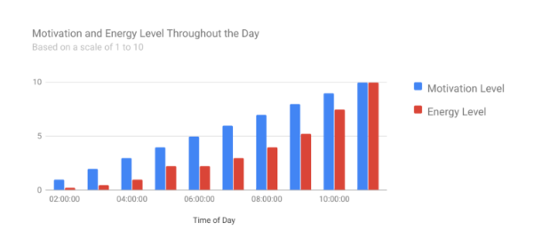
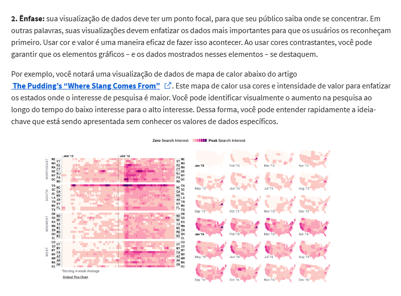
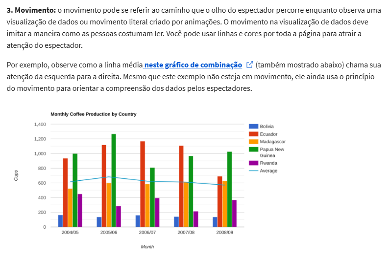
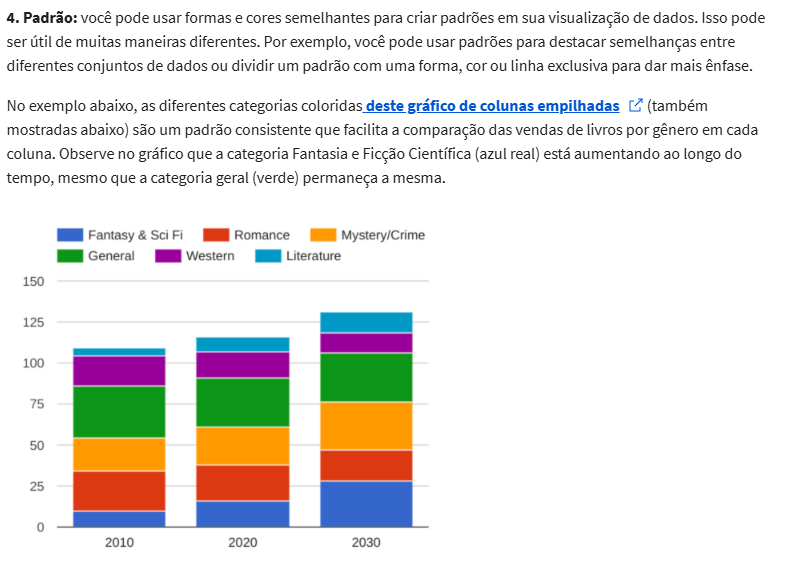
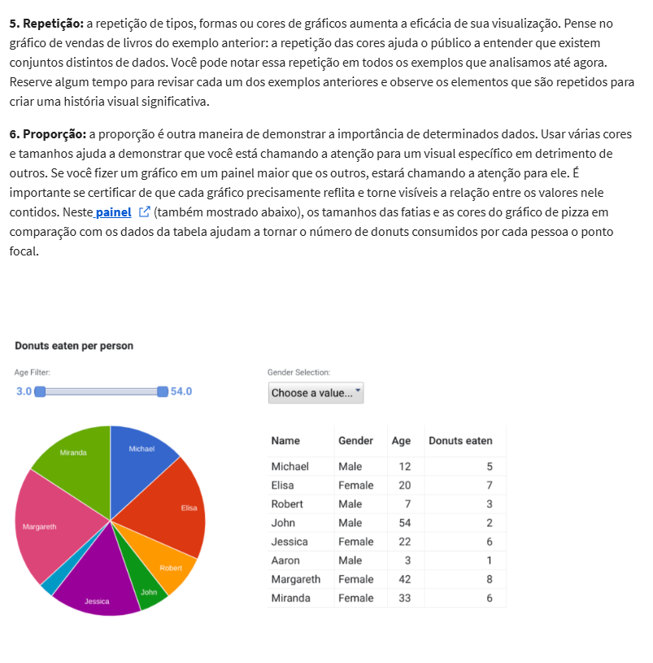
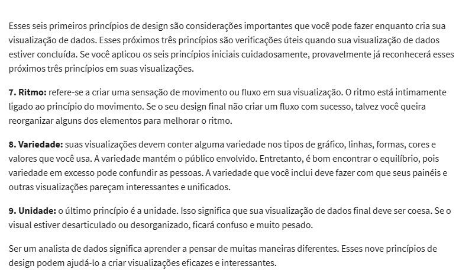

# Elements of art

*   Line
*   Shape
*   Space
*   Color - hue, intensity, value
*   Movement - Sense of flow

## Equilíbrio 

Cor e forma são distribuídos uniformemente. Isso não significa que você precisa de simetria completa, mas sua visualização não deve ter um lado diferente do outro. Se sua visualização de dados estiver equilibrada, isso pode significar que as linhas usadas para criar os gráficos são semelhantes em comprimento em ambos os lados ou que o espaço entre os objetos é igual. 

