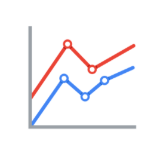
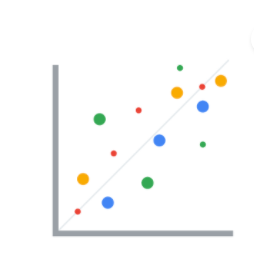
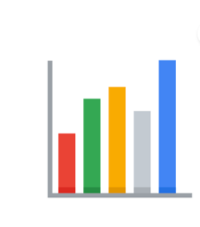
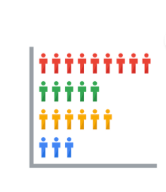
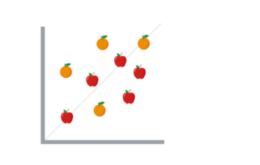
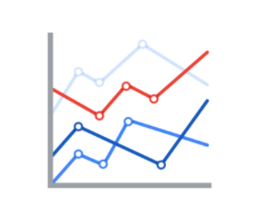
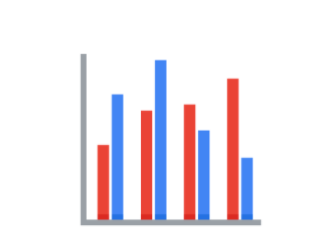
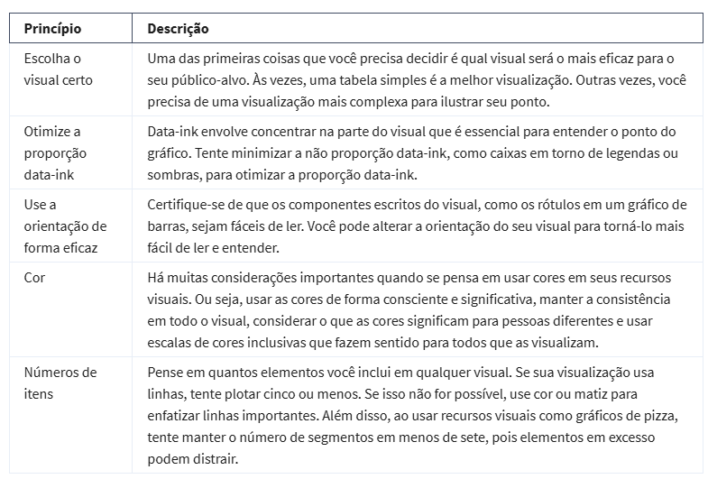

# Comunicação de insights de dados

Share data using charts, visualization , story , so that business can make better decisions. 

There are stories behind the visualization. Data visualization is the graphic representation and presentation of data tha can be easy to people understand. 

1.  Looking at visuals in order to understand and draw conclusions about data.

2.  Creating visuals using raw data to tell a story

The audience should know exactly what they´re looking at within the first five. And five seconds after that , the audience should understando the conclusion your visualization is making 

### O Método McCandless

Você aprendeu sobre o método David McCandless na primeira lição sobre visualizações de dados eficazes, mas, para relembrar, o Método McCandless lista quatro elementos de uma boa visualização de dados: 

Informações: os dados com os quais você está trabalhando

História: uma narrativa ou conceito claro e convincente

Meta: um objetivo ou função específica para o visual

Forma visual: um uso eficaz da metáfora ou expressão visual

## Perguntas para ajudar a interpretação de visualização de dados pelos consumidores

1.  Qual é a questão prática ?
2.  O que o visual diz ?
3.  O que os dados dizem ?

Essas perguntas ajudam a se colocar no lugar do público alvo para ver se a comunicação dos dados estão sendo feitas de maneira eficaz.

## Atributos pré-atencionais: marcas e canais

Criar recursos visuais eficazes significa aproveitar o que sabemos sobre o funcionamento do cérebro e, em seguida, usar elementos visuais específicos para comunicar a informação de forma eficaz. Atributos pré-atencionais são os elementos de uma visualização de dados que as pessoas reconhecem automaticamente sem esforço consciente. Os blocos de construção essenciais e básicos que tornam os visuais imediatamente compreensíveis são chamados de marcas e canais. 

*   Marcas são objetos visuais como linhas, pontos.

    Posição

    
 

    Tamanho

    
 

    Cor

    
 

    Formas

    

*   Canais são aspectos variáveis que representam características dos dados

    Precisão : Método utilizado para diferenciar com precisão os valores apresentados. Exemplo, em um gráfico que mostra maçãs e laranjas, se os dois tipos de
    dados estiverem com suas cores específicas, os dados estarão sendo apresentados com precisão, doque se estivessem com a mesma cor porem com o talo diferentes mas parecidos.

    

    Popout : O quão fácil é distinguir elementos de outros. Comprimento da linha, forma, tamanho, largura

    

    Agrupamentos : O quanto um canal é bom para comunicação de grupos que existem nos dados 
    Considere a proximidade, similaridade, fechamento, conectividade e continuidade do canal.

    

    ## Princípio de design

    

    ## O que evitar no design 

    

## Connections between data and images

*   Bar graphs, use size contrast to compare two or more values.
*   Line  graphs, helps the audience understand shifts or changes in your data
*   Pie charts, show how much each part of something makes uo the whole
*   Maps

## Correlation and causation

### Tyoe of visualization
* Static visualization doesn´t change
* Nynammic visualization can change

### The elements of art

*   Line
*   Color
*   Shape
*   Space
*   Movement

## Bringing Design thinking

Making decisions based on the needs of the people who will be viewing that.

* Empathize -> Emotions and needs of the target audience
* Define ->  Helps to define your audience needs, their problems and your insights
* Ideate -> Start to generate your ideias
* Prototype -> 
* Teste ->  .
