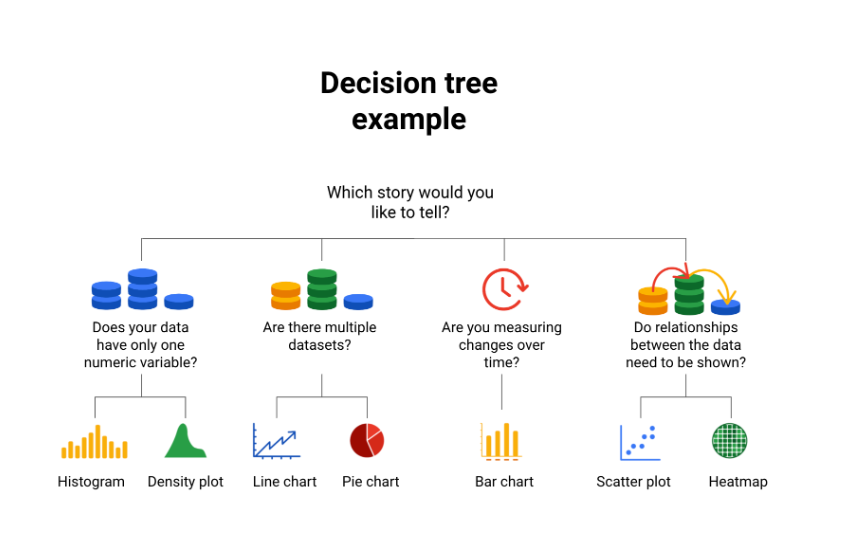

## Static visualizations

Do not change overtime unless there´re edited . Can be useful when you wanna control and store your data

##  Dynamic visualizations

Are interactive or change overtime

### Os dados crescem nas árvores de decisão

Com tantas opções de visualização disponíveis para você escolher, como você decide qual é a melhor maneira de representar seus dados? 

Uma árvore de decisão é uma ferramenta de tomada de decisão que permite que você, analista de dados, tome decisões com base em perguntas-chave que pode fazer a si mesmo. Cada pergunta na visualização árvore de decisão o ajudará a tomar uma decisão sobre recursos críticos para sua visualização. Abaixo está um exemplo de uma árvore de decisão básica para orientá-lo a tomar uma decisão baseada em dados sobre qual visualização é a melhor maneira de contar sua história. Observe que existem muitos tipos diferentes de árvores de decisão que variam em complexidade e podem fornecer decisões mais detalhadas. 

