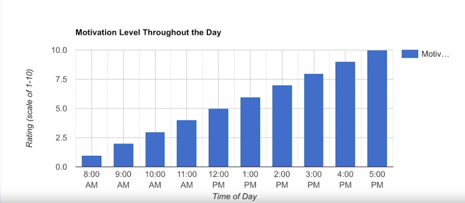
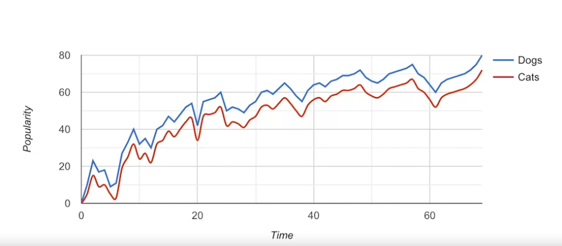
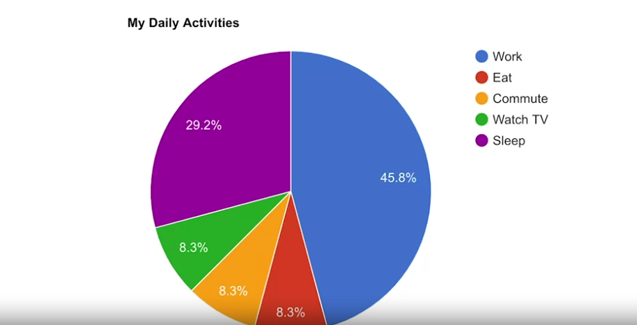
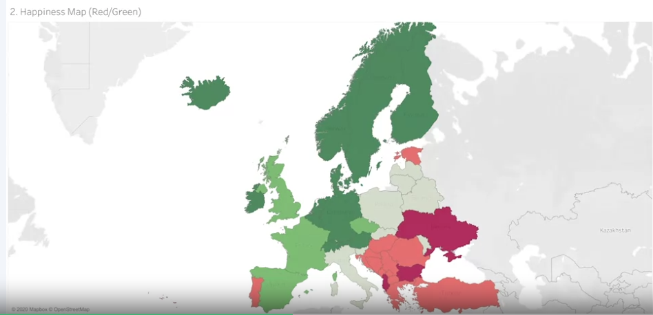

# Examples of visualization

##  Bar graphs

Bar graphs uses size contrast to compare two or more values

## Line graphs

Helps the audience understand changes and shifts in the data

## Pie charts

It shows how much each part of something makes up the whole

## Maps 

Helps organize data geographcally

##  What visualization can reveal to the audience ?

Where you would like your audience to focus ? . That´s the biggest considerations when creating a data vizualization

Don´t show too data and less data. Just restrict the visualization.

## Correlação e causalidade

*   Correlação em estatística é a medida do grau em que duas variáveis mudam em relação uma à outra. Um exemplo de correlação é a ideia de que “à medida que a temperatura sobe, as vendas de sorvete também sobem”. É importante lembrar que a correlação não significa que um evento causa outro. Mas, isso indica que eles têm um padrão ou um relacionamento entre si. Se uma variável aumenta e a outra variável também aumenta, é uma correlação positiva. Se uma variável aumenta e a outra variável diminui, é uma correlação negativa ou inversa. Se uma variável aumenta e a outra permanece praticamente a mesma, não há correlação.

*   Causalidade refere-se à ideia de que um evento leva a um resultado específico. Por exemplo, quando um relâmpago cai, ouvimos o trovão (onda sonora) causado pelo aquecimento e resfriamento do ar do relâmpago. O relâmpago causa o trovão. 

Por que a diferenciação entre correlação e causalidade é importante? 
Ao tirar conclusões da análise de dados, você precisa garantir que não supõe uma relação causal entre elementos de seus dados quando houver apenas uma correlação. Quando seus dados mostram que a temperatura externa e o consumo de sorvete aumentam ao mesmo tempo, pode ser tentador concluir que o clima quente causa nas pessoas a vontade de tomar sorvete. Porém, um exame mais detalhado dos dados revelaria que cada mudança na temperatura não leva a uma mudança nas compras de sorvete. Além disso, pode ter havido uma venda de sorvete ao mesmo tempo em que os dados foram coletados, o que pode não ter sido considerado em sua análise. 

Saber a diferença entre correlação e causalidade é importante quando você tira conclusões de seus dados, pois os riscos podem ser altos. Os próximos dois exemplos ilustram os altos riscos para a saúde e os serviços humanos. 

Causa da doença
Por exemplo, a pelagra é uma doença com sintomas de tontura, feridas, vômitos e diarreia. No início de 1900, as pessoas pensavam que a doença era causada por condições de vida insalubres. A maioria das pessoas que contraíram pelagra também vivia em ambientes insalubres. Porém, um exame mais detalhado dos dados mostrou que a pelagra era o resultado da falta de niacina (vitamina B3). As condições insalubres estavam relacionadas à pelagra porque a maioria das pessoas que não podiam comprar alimentos ricos em niacina também não podiam viver em condições mais sanitárias. Contudo, as condições insalubres de vida acabaram sendo apenas uma correlação.

Distribuição de ajuda
Vejamos outro exemplo: suponha que você esteja trabalhando para uma agência governamental que fornece vale-refeição. Você notou no Google Analytics da agência que as pessoas que se qualificam para o vale-refeição estão navegando no site oficial, mas estão saindo do site sem se inscrever no benefício. Você acha que as pessoas que visitam o site estão saindo porque não estão encontrando as informações necessárias para se inscrever no vale-refeição. O Google Analytics pode ajudá-lo a encontrar pistas (correlações), como o retorno frequente das mesmas pessoas ou a rapidez com que elas saem da página. Uma dessas correlações pode levar você à causa real, mas será necessário coletar dados adicionais, como em uma pesquisa, para saber exatamente por que as pessoas que acessam o site não estão se inscrevendo no vale-refeição. Só assim você poderá descobrir como aumentar a taxa de inscrição.